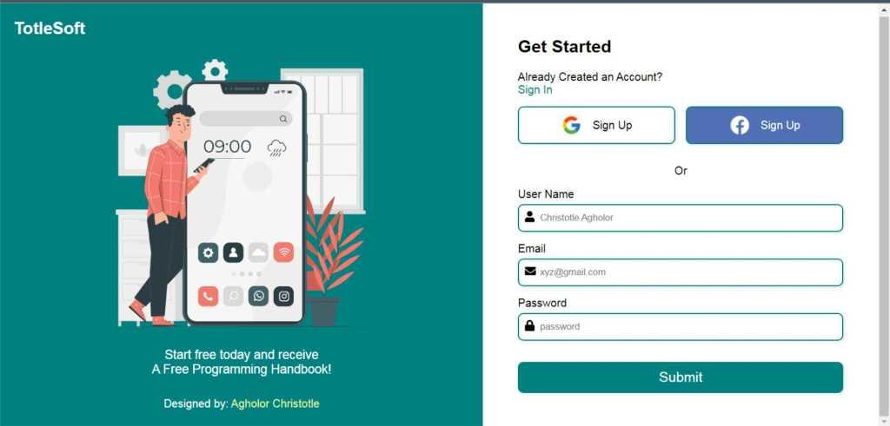

# JavaScript Form Validation #
A responsive Login Page built with HTML, CSS, and JavaScript.

### Marketplace



## What Was Covered in This Project ##
Writing the HTML
Adding the CSS
Writing the JavaScript
Adding a social media button
Adding the images
Media queries for the mobile version (responsive)

## View Live Site: ##
https://form-validation.s3.eu-west-2.amazonaws.com/index.html?

## To View The Site ##
Follow these steps: 

**1.** Clone the repo.
```
git clone https://github.com/johnchristotle/Form-Validation.git
```

**2.**  ```cd``` into repo. Use your own directory name eg cd my-directory-name OR
Use the same directory name(below) if you do not change it.
```
cd Form-Validation
```

**3.** Open the directory folder on  ```VS-Code``` or any text editor of your choice.

**4.** Right-click on the  ```index.html file``` and click ``` Open With Live Server ```.

**5.** This will launch the site to your local host server e.g ```http://127.0.0.1:5500/Form-Validation/index.html ``` 

Love the job? 

buy me a cofee: 
```Metamask Wallet: 0xF14Ecc350Dc9190909F512522E0A8b5D61610881```

Thanks!